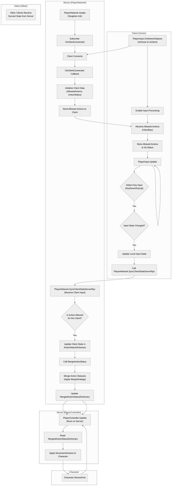

# 네트워크 구조?

## 설명 (by gemini)

네, 제공해주신 Unity Netcode 코드의 주요 흐름을 나타내는 Mermaid 플로우차트입니다.

이 플로우차트는 다음과 같은 주요 구성 요소 간의 상호작용을 보여줍니다:

1.  **Client (Owner)**: 현재 플레이어가 조종하는 오브젝트의 `PlayerInput` 컴포넌트가 활성화된 클라이언트입니다. 키보드 입력을 감지하고 서버로 보냅니다.
2.  **Server**: 모든 클라이언트의 연결 및 입력을 관리하고 병합하는 `PlayerNetwork` 싱글톤 인스턴스가 실행되는 곳입니다. 또한 캐릭터 오브젝트의 `PlayerController`가 실행되어 실제 움직임을 처리합니다.
3.  **Character**: 서버에서 `PlayerController`에 의해 움직임이 적용되는 대상입니다.
4.  **Client (Other)**: 조종 권한이 없는 다른 클라이언트입니다. 이 플로우에서는 주로 서버로부터 캐릭터 상태를 동기화 받아 보여주는 역할을 하겠지만, 제공된 코드에서는 해당 부분이 명시되지 않아 입력 관련 흐름만 포함했습니다.

**플로우 설명:**

1.  **클라이언트 연결 및 초기화:**

      * 클라이언트가 서버에 연결되면 (L), 서버의 `PlayerNetwork` 싱글톤에서 `OnClientConnected` 콜백이 트리거됩니다 (M).
      * 서버는 연결된 클라이언트의 데이터(허용된 액션 목록 및 초기 입력 상태)를 초기화하고 저장합니다 (N).
      * 서버는 해당 클라이언트의 `PlayerObject`에 있는 `PlayerInput` 컴포넌트를 찾아 (O) 허용된 액션 목록을 ClientRpc(`ReceiveAllowedActionsClientRpc`)를 통해 해당 클라이언트에게 보냅니다 (C).
      * 클라이언트의 `PlayerInput` 스크립트는 이 RPC를 받고 허용된 액션 목록과 로컬 상태를 저장합니다 (D). 만약 이 클라이언트가 캐릭터의 소유자라면 입력 처리가 활성화됩니다 (A -\> B).

2.  **클라이언트 입력 및 서버 전송:**

      * 조종 권한이 있는 클라이언트에서 `PlayerInput.Update`가 매 프레임 실행됩니다 (E).
      * 키보드 입력(KeyDown/KeyUp)이 감지되면 (F), 로컬에서 추적하는 입력 상태와 비교하여 상태 변화가 있는지 확인합니다 (G).
      * 상태가 변경되었으면 로컬 상태를 업데이트하고 (H), 서버의 `PlayerNetwork` 싱글톤에 ServerRpc(`SyncClientStateServerRpc`)를 호출하여 변경된 액션과 상태 값을 전송합니다 (I).

3.  **서버에서의 입력 수신 및 병합:**

      * 서버의 `PlayerNetwork` 싱글톤은 클라이언트로부터 ServerRpc 호출을 받습니다 (P).
      * 수신된 액션이 해당 클라이언트에게 허용된 액션인지 확인합니다 (Q).
      * 허용된 액션이라면, `ActionStatusDictionary`에서 해당 클라이언트의 상태를 업데이트합니다 (R).
      * 클라이언트 상태 업데이트 후, 모든 클라이언트의 입력 상태를 병합하는 `MergeActionStatus` 함수를 호출합니다 (S).
      * `MergeActionStatus` 함수는 설정된 `MergeStrategy`(현재는 `Latest` 로직 - 다만 코멘트에서 언급했듯 현재 구현은 엄밀한 의미의 Latest가 아닐 수 있음)에 따라 `ActionStatusDictionary`의 모든 클라이언트 상태를 합산하여 (T), 최종 병합된 상태인 `MergedActionStatusDictionary`를 업데이트합니다 (U).

4.  **서버에서의 캐릭터 제어:**

      * 서버에서 실행되는 캐릭터 오브젝트의 `PlayerController.Update`가 매 프레임 실행됩니다 (V).
      * `PlayerController`는 `PlayerNetwork` 싱글톤에서 최신 `MergedActionStatusDictionary` 값을 읽어옵니다 (W).
      * 읽어온 병합된 입력 상태에 따라 캐릭터의 움직임이나 액션을 적용합니다 (X).
      * 캐릭터가 실제로 움직이거나 행동합니다 (Y).

이 플로우는 서버가 모든 클라이언트 입력을 중앙에서 관리하고 병합하여 최종 캐릭터 상태를 결정하는 **서버 권한(Server Authoritative)** 입력 처리 방식을 따르고 있음을 보여줍니다.
